# Learn It Right Way
This project is a full-stack web application built using React js for the frontend, Express js for the backend, and MySQL as the database. The application is designed to demonstrate the implementation of a 3-tier architecture, where the presentation layer (React js), application logic layer (Express js), and data layer (MySQL) are separated into distinct tiers.


## User Interface Screenshots & Expected Result
#### Dashboard


#### Books


#### Authors


# Our Deployment

## React + Node.js + MySQL Deployment Guide (AWS)

## This project code has been reformatted by me in order to get the same result as the original author, so that the code can be deployed either using Userdata method or Containerisation method.

### This document summarizes the final configuration steps used to prepare and deploy a full-stack application (React frontend + Node.js/Express backend + MySQL on RDS) to AWS.

### 00. We git clone the repo from our forked repo on github 

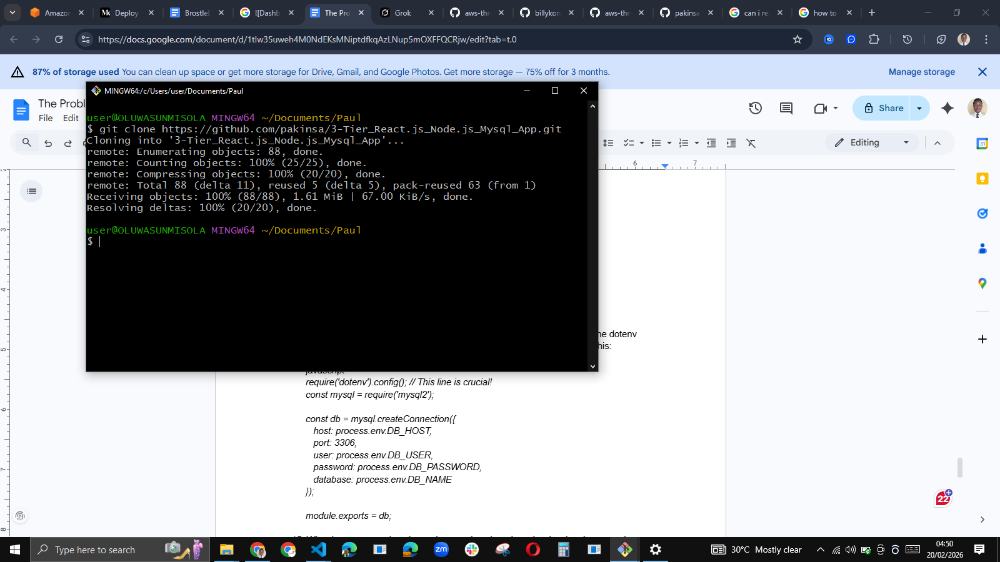

### 1. We created a file named .env in the frontend/ and updated it with:

`frontend/.env`
##### Use your Backend EC2 Public IP or APP ALB DNS here
##### Always change this before running the frontend application as build or containerised version
`VITE_API_URL=http://<YOUR_BACKEND_EC2_IP>:3000/api` 

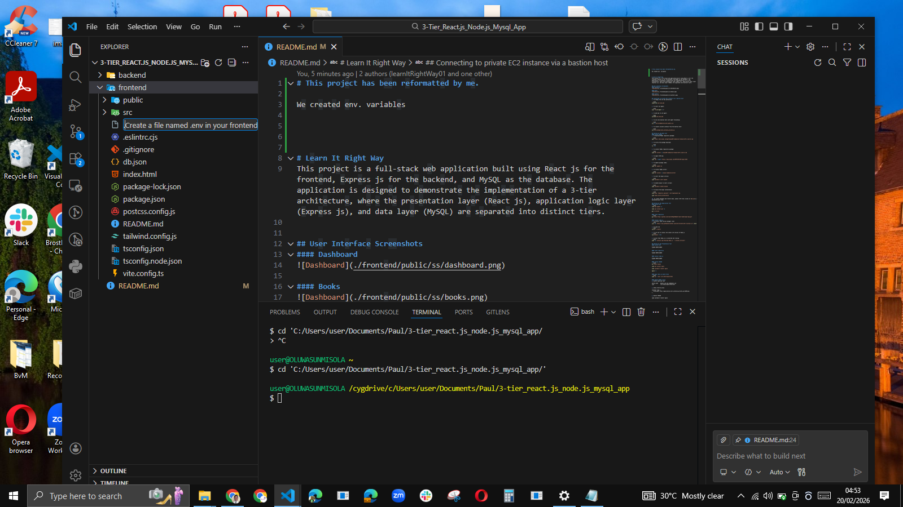

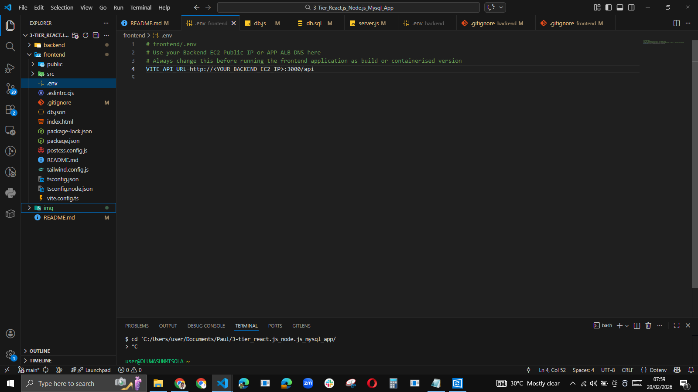


### 2. We created an .env for backend/ and updated it with:

```bash
PORT=3000  # note this port is for app alb not DB
DB_HOST=<YOUR_RDS_ENDPOINT_HERE>   # YOUR_RDS_ENDPOINT_HERE
DB_USER=root                        # your_rds_root_username
DB_PASSWORD=your_rds_password       # your_rds_password
DB_NAME=backend                     # your_rds_database_name 
```

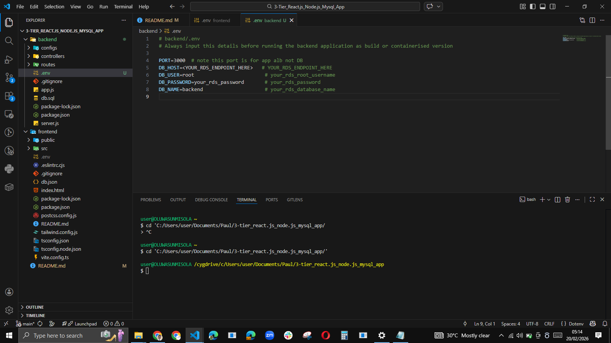


### 3.We updated the db.js which was of this:

```bash
const mysql = require('mysql2');

const db = mysql.createConnection({
   host: 'localhost',
   port: '3306',
   user: 'root',
   password: '12345678',
   database: 'react_node_app'
});

module.exports = db;
```
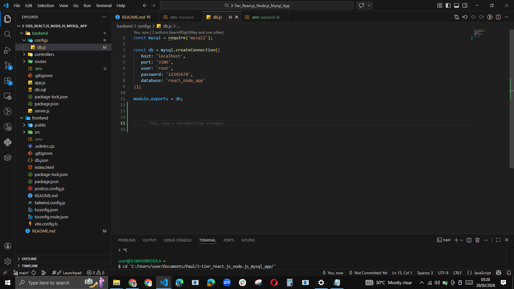


TO THIS:
To make the Backend actually read these variables, we need to install the dotenv package (```npm install dotenv```) and update your configs/db.js like this:

```bash
# javascript
require('dotenv').config(); // This line is crucial!
const mysql = require('mysql2');

const db = mysql.createConnection({
   host: process.env.DB_HOST,
   port: 3306,
   user: process.env.DB_USER,
   password: process.env.DB_PASSWORD,
   database: process.env.DB_NAME
});

module.exports = db;
```

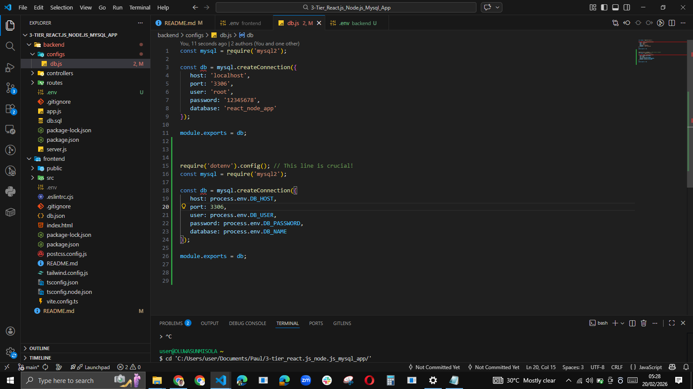

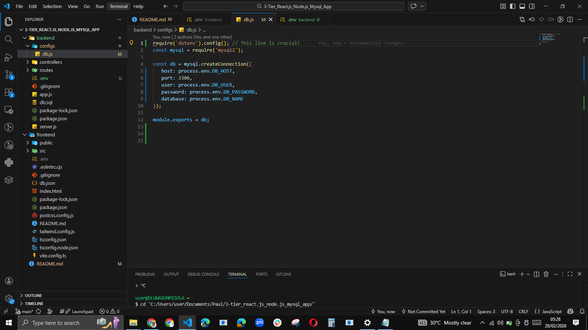


### 4. We inserted respective values of our env files for both frontend and backend and put .env in our .gitignore for both frontend & backend

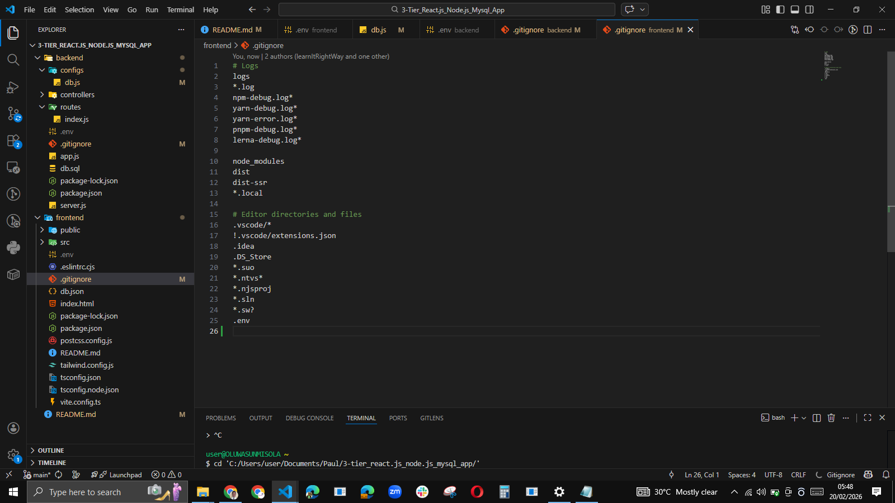

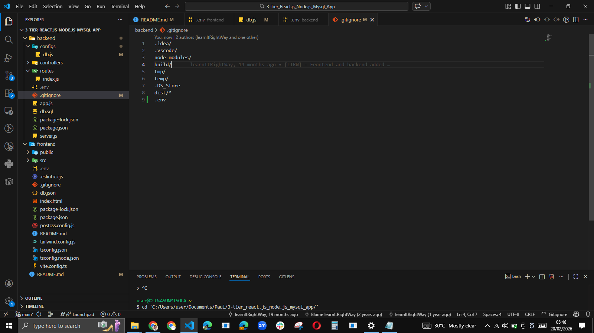


### 5. In server.js from developer where we have:

```bash
const app = require('./app');
const port = process.env.PORT || 3200;

app.listen(port, () => {
  console.log(`Server is running on port http://localhost:${port}`);
});
```

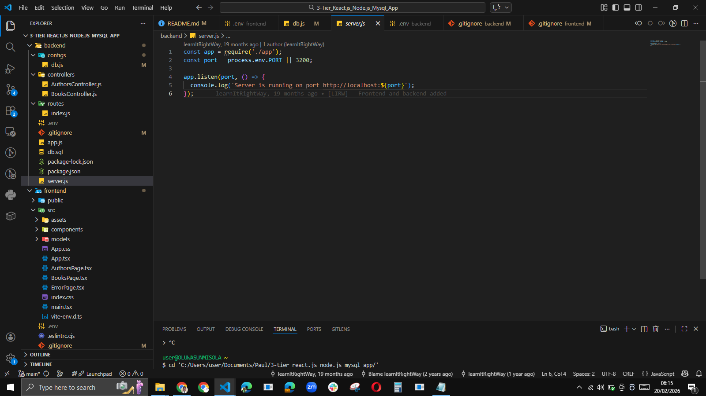


We have to change it to:


```bash
const app = require('./app');
const port = process.env.PORT || 3000;

app.listen(port, '0.0.0.0', () => {
  console.log(`Server is running on port ${port}`);
});
```

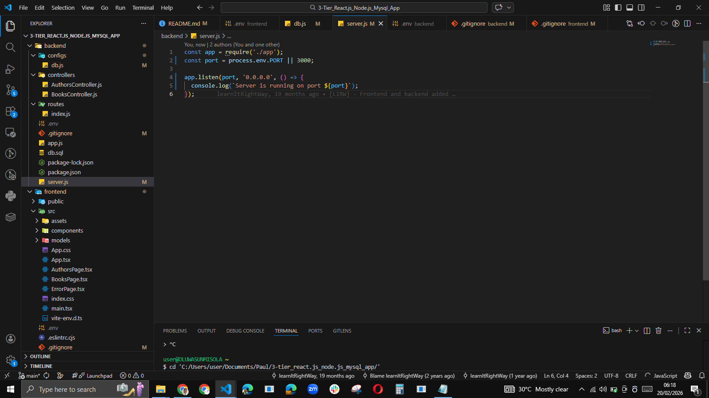


Remember if you have the same .env variables in code and also in user data then the userdata is superior. This ensures the "local" secrets never even make it into the ZIP file or GitHub. 
The User Data is the only source of truth in the cloud.
Important Rule: Environment variables defined in EC2 User Data / Parameter Store / Secrets Manager take precedence over any values that might accidentally be in code or ZIP files. Never commit .env files — even by mistake.


### 6. We installed ```npm install dotenv``` for our backend then we ran ```npm run build``` in backend directory

For Backend:
```bash
cd backend
npm install dotenv mysql2  # Install these so the code knows how to use .env and RDS
# DO NOT run 'npm run build' here (Standard Node.js backends don't need a build step)
rm -rf node_modules       # Remove this to make the ZIP small (User Data installs it for you)
zip -r ../backend-build.zip ./*
```


### 7. We ran ```npm run build``` for frontend for S3 in frontend directory 

For Frontend:
```bash
cd frontend
npm install              # Ensure all React dependencies are there
npm run build            # This creates the 'dist' folder (The Actual Website)
cd dist
zip -r ../../frontend-build.zip ./*
```

We did not run npm install dotenv due to:
The frontend is a Vite + React app. Vite has built-in support for .env files.
The Backend: Needs the dotenv package because standard Node.js doesn't "know" how to read .env files.
The Frontend: Vite automatically looks for any file named .env and "bakes" those variables into the code when you run npm run build. You do not need to install an extra package for this.


### 8.  We git push origin branch added as a new pull request on this github with a new branch before the next steps were taken
#### We ignored our frontend-build.zip and backend-build.zip by creating a .gitignore in the root of our repo and finally commit on branch.

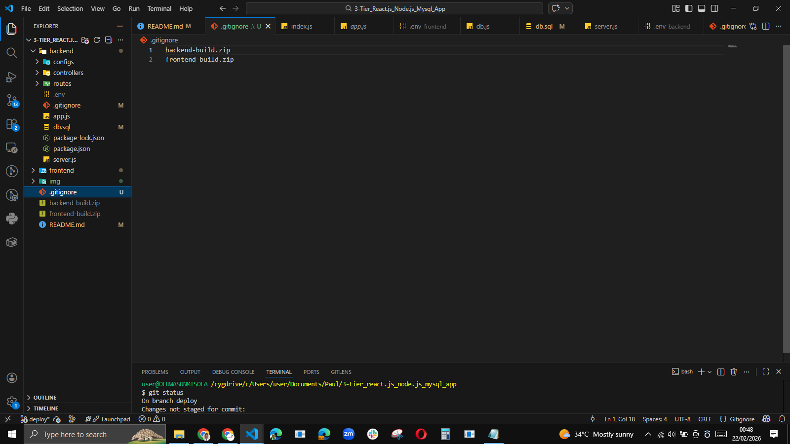


#### Deploy to your Forked and Original Repo
```git push origin deploy``` # deploy is the name of my branch, change yours

#### Deploy to your forked repo only
```git push -u origin deploy```  


## Deployment Methods

### Method 1: USER DATA Method
### 01. We uploaded the Zip files only of both Frontend and backend into S3 on AWS and pasted our respective userdata using Userdata deployment method

Note our web and app tier user data is used with Amazon Linux 2023.

* Web tier User Data

```bash
#!/bin/bash
set -euo pipefail

# 1. Install dependencies
sudo dnf update -y
sudo dnf install -y nginx unzip awscli

# 2. Variables
S3_BUCKET="paul-3tier-zip"
ZIP_FILE="frontend-build.zip"
# IMPORTANT: Put your ALB DNS or App EC2 IP here
APP_ALB_DNS="internal-app-tier-alb-2037459119.us-east-1.elb.amazonaws.com"

# 3. CONFIGURE MAIN NGINX (Core Settings)
sudo mv /etc/nginx/nginx.conf /etc/nginx/nginx.conf.bak
sudo tee /etc/nginx/nginx.conf << 'EOF'
user nginx;
worker_processes auto;
error_log /var/log/nginx/error.log notice;
pid /run/nginx.pid;

events {
    worker_connections 1024;
}

http {
    include       /etc/nginx/mime.types;
    default_type  application/octet-stream;
    sendfile        on;
    keepalive_timeout  65;
    include /etc/nginx/conf.d/*.conf;
}
EOF

# 4. Download and Extract Frontend
sudo aws s3 cp "s3://${S3_BUCKET}/${ZIP_FILE}" /tmp/${ZIP_FILE}
sudo unzip -o /tmp/${ZIP_FILE} -d /usr/share/nginx/html/

# 5. Immediate fix for the 'dist' subfolder
if [ -d "/usr/share/nginx/html/dist" ]; then
    sudo mv /usr/share/nginx/html/dist/* /usr/share/nginx/html/
    sudo rm -rf /usr/share/nginx/html/dist
fi

# 6. THE CRITICAL FIX: Replace Placeholder with Relative Path
sudo find /usr/share/nginx/html/ -type f -name "*.js" -exec sed -i 's|http://<YOUR_BACKEND_EC2_IP>:3000/api|/api|g' {} +

# 7. Metadata (Correct IMDSv2 paths)
TOKEN=$(curl -s -X PUT "http://169.254.169.254/latest/api/token" -H "X-aws-ec2-metadata-token-ttl-seconds: 21600")
INSTANCE_ID=$(curl -s -H "X-aws-ec2-metadata-token: $TOKEN" http://169.254.169.254/latest/meta-data/instance-id)
AVAIL_ZONE=$(curl -s -H "X-aws-ec2-metadata-token: $TOKEN" http://169.254.169.254/latest/meta-data/placement/availability-zone)
PUBLIC_IP=$(curl -H "X-aws-ec2-metadata-token: $TOKEN" "http://169.254.169.254/latest/meta-data/public-ipv4")

sudo tee /usr/share/nginx/html/test.html <<EOF
<!DOCTYPE html>
<html>
<head>
    <title>Server Info</title>
    <style>
        body { font-family: sans-serif; display: flex; justify-content: center; align-items: center; height: 100vh; margin: 0; background: #232f3e; color: white; }
        .card { background: #ffffff; color: #333; padding: 2rem; border-radius: 12px; box-shadow: 0 4px 20px rgba(0,0,0,0.3); text-align: center; }
        h1 { color: #ec7211; }
        .data { font-family: monospace; background: #eee; padding: 2px 6px; border-radius: 4px; color: #d13212; }
    </style>
</head>
<body>
    <div class="card">
        <h1>EC2 Metadata</h1>
        <p><strong>Instance ID:</strong> <span class="data">$INSTANCE_ID</span></p>
        <p><strong>AZ:</strong> <span class="data">$AVAIL_ZONE</span></p>
        <hr>
        <p><small>Served by Nginx on Amazon Linux 2023</small></p>
    </div>
</body>
</html>
EOF

# 8. Fix Permissions
sudo chown -R nginx:nginx /usr/share/nginx/html/
sudo find /usr/share/nginx/html/ -type d -exec chmod 755 {} +
sudo find /usr/share/nginx/html/ -type f -exec chmod 644 {} +

# 9. Create Server-Specific Configuration (USING 'EOF' TO PREVENT BASH ERRORS)
cat << 'EOF' | sudo tee /etc/nginx/conf.d/default.conf
server {
    listen 80 default_server;
    server_name _;
    root /usr/share/nginx/html;
    index index.html;

    location = /test.html {
        try_files /test.html =404;
    }

    location /api/ {
        # We use a placeholder here and swap it in Step 10
        proxy_pass http://REPLACE_WITH_ALB_DNS:3000;
        proxy_set_header Host $host;
        proxy_set_header X-Real-IP $remote_addr;
        proxy_set_header X-Forwarded-For $proxy_add_x_forwarded_for;
    }

    location / {
        try_files $uri $uri/ /index.html;
    }
    
    location /health {
        return 200 'OK';
        add_header Content-Type text/plain;
    }
}
EOF

# 10. Inject the Variable into the Placeholder and Start
sudo sed -i "s|REPLACE_WITH_ALB_DNS|${APP_ALB_DNS}|g" /etc/nginx/conf.d/default.conf

# 11. Final Validation and Start
sudo nginx -t
sudo systemctl enable --now nginx
```


* App tier User Data

```bash
#!/bin/bash
set -euo pipefail

# 1. Install Node.js, PM2 & MariaDB Client (to run SQL)
sudo dnf update -y
sudo dnf install -y nodejs npm unzip awscli mariadb105

# 2. Install PM2 globally
sudo npm install -g pm2

# 3. Variables
S3_BUCKET="paul-3tier-zip"
ZIP_FILE="backend-build.zip"
APP_DIR="/home/ec2-user/app"
DB_HOST="three-tier-db-books.c4j4kiq2ck9b.us-east-1.rds.amazonaws.com" # ensure you remove this RDS endpoint and replcace with yours
DB_USER="admin"
DB_PASS="BROSTLE2026!"
DB_NAME="react_node_app"

# 4. Download and Extract
mkdir -p "$APP_DIR"
aws s3 cp "s3://${S3_BUCKET}/${ZIP_FILE}" /tmp/${ZIP_FILE} --region us-east-1
unzip -o /tmp/${ZIP_FILE} -d "$APP_DIR"

# 5. Environment Config
cat > "$APP_DIR/.env" << EOF
DB_HOST=$DB_HOST
DB_PORT=3306
DB_USER=$DB_USER
DB_PASSWORD=$DB_PASS
DB_NAME=$DB_NAME
PORT=3000
EOF

# 6. Fix Permissions and Install dependencies
chown -R ec2-user:ec2-user "$APP_DIR"
cd "$APP_DIR"
sudo -u ec2-user npm install --production
sudo -u ec2-user npm install dotenv mysql2

# 7. REWRITE server.js (The "Smoking Gun" Fix)
sudo -u ec2-user tee "$APP_DIR/server.js" << 'EOF'
require('dotenv').config();
const app = require('./app');
const port = process.env.PORT || 3000;
app.listen(port, '0.0.0.0', () => {
  console.log(`Server is running on port ${port}`);
});
EOF

# 8. REWRITE db.js (Ensures RDS connection)
mkdir -p "$APP_DIR/configs"
sudo -u ec2-user tee "$APP_DIR/configs/db.js" << 'EOF'
const mysql = require('mysql2');
require('dotenv').config();
const db = mysql.createConnection({
   host: process.env.DB_HOST,
   port: process.env.DB_PORT,
   user: process.env.DB_USER,
   password: process.env.DB_PASSWORD,
   database: process.env.DB_NAME
});
db.connect((err) => {
    if (err) { console.error('Error connecting to MySQL:', err); return; }
    console.log('Connected to RDS MySQL Database!');
});
module.exports = db;
EOF

# 9. DYNAMIC DATABASE INITIALIZATION
# This version uses SINGULAR table names to match the Node.js code
mysql -h "$DB_HOST" -u "$DB_USER" -p"$DB_PASS" -e "CREATE DATABASE IF NOT EXISTS $DB_NAME;"

mysql -h "$DB_HOST" -u "$DB_USER" -p"$DB_PASS" "$DB_NAME" << 'EOF'
-- 1. Create Tables (SINGULAR names to match BooksController.js)
CREATE TABLE IF NOT EXISTS author (
  id int NOT NULL AUTO_INCREMENT,
  name varchar(255) NOT NULL,
  birthday date NOT NULL,
  bio text NOT NULL,
  createdAt date NOT NULL,
  updatedAt date NOT NULL,
  PRIMARY KEY (id)
) ENGINE=InnoDB;

CREATE TABLE IF NOT EXISTS book (
  id int NOT NULL AUTO_INCREMENT,
  title varchar(255) NOT NULL,
  releaseDate date NOT NULL,
  description text NOT NULL,
  pages int NOT NULL,
  createdAt date NOT NULL,
  updatedAt date NOT NULL,
  authorId int DEFAULT NULL,
  PRIMARY KEY (id),
  CONSTRAINT FK_author_link FOREIGN KEY (authorId) REFERENCES author (id)
) ENGINE=InnoDB;

-- 2. Seed Data
INSERT INTO author (id, name, birthday, bio, createdAt, updatedAt) 
SELECT 1, 'J.K. Rowling', '1965-07-31', 'British author of the Harry Potter series.', '2024-05-29', '2024-05-29'
WHERE NOT EXISTS (SELECT 1 FROM author WHERE id = 1);

INSERT INTO book (id, title, releaseDate, description, pages, createdAt, updatedAt, authorId)
SELECT 1, 'Harry Potter and the Sorcerer''s Stone', '1997-07-26', 'A young wizard discovers his heritage.', 223, '2024-05-29', '2024-05-29', 1
WHERE NOT EXISTS (SELECT 1 FROM book WHERE id = 1);
EOF


# 10. Start with PM2
sudo -u ec2-user pm2 delete all || true
sudo -u ec2-user pm2 start "$APP_DIR/server.js" --name "backend" --update-env
sudo -u ec2-user pm2 save
sudo env PATH=$PATH:/usr/bin /usr/lib/node_modules/pm2/bin/pm2 startup systemd -u ec2-user --hp /home/ec2-user
```

#### Results

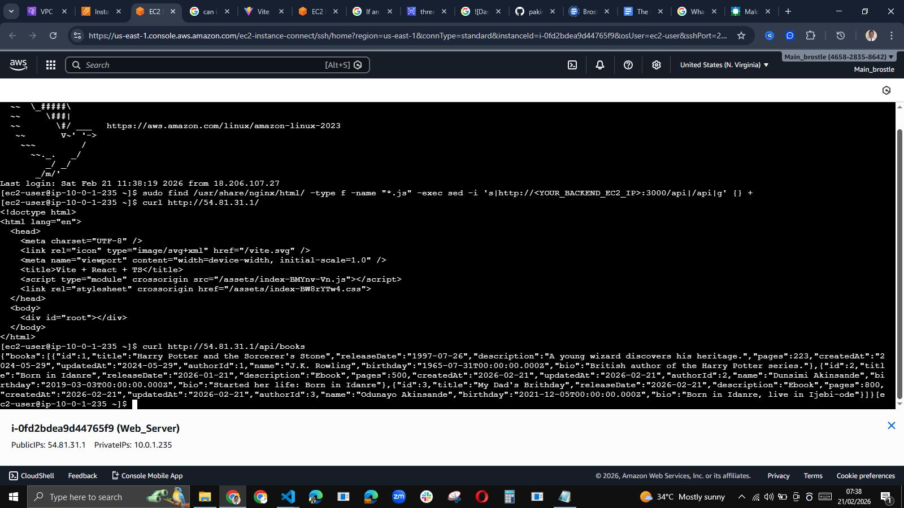

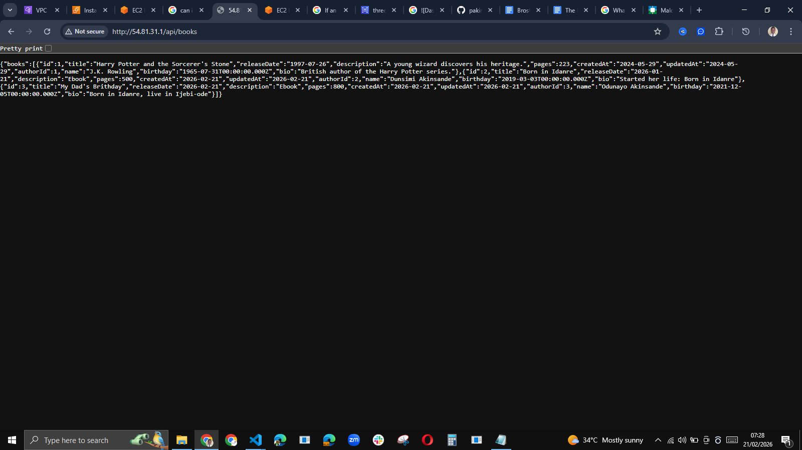

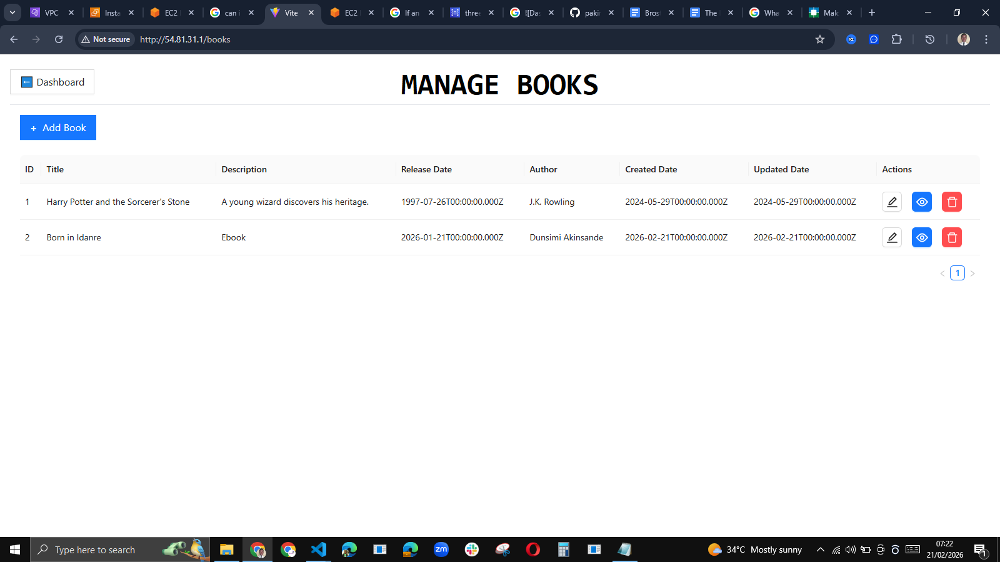

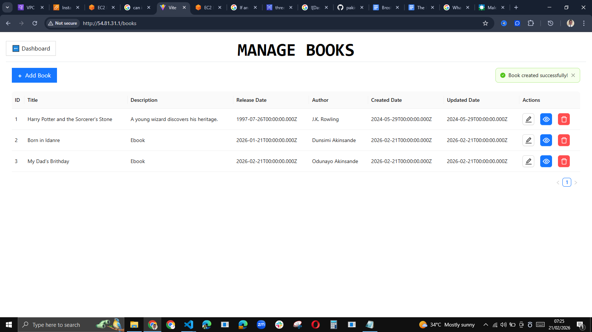

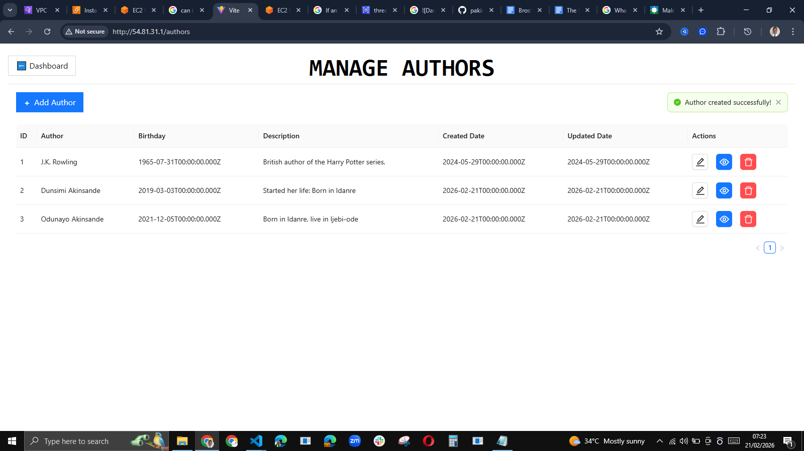

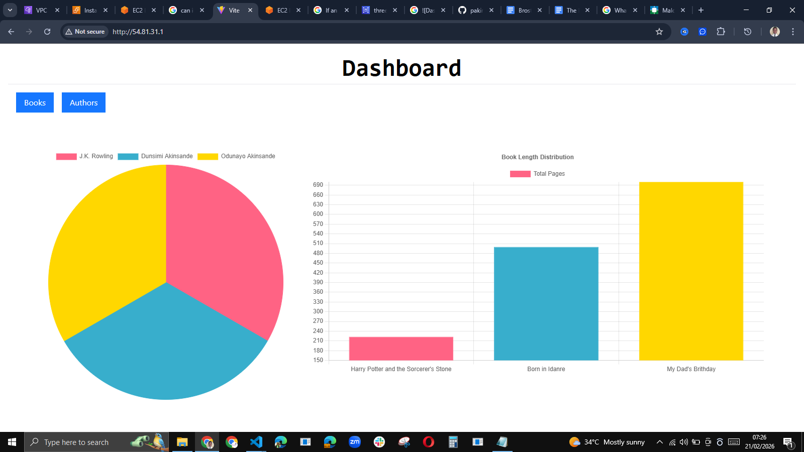

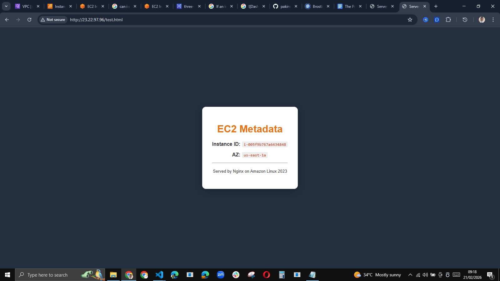


#### Interesting commands we used for deugging are:

```sudo systemctl status nginx```

```cat /etc/nginx/conf.d/default.conf```

```sudo tail -n 20 /var/log/cloud-init-output.log```

```mysql -h three-tier-db-books.c4j4kiq2ck9b.us-east-1.rds.amazonaws.com -u admin -p```

SHOW DATABASES;
USE react_node_app;
SHOW TABLES;
SELECT * FROM TABLE author;
SELECT * FROM TABLE book;
DROP TABLE author;
DROP TABLE book;


### Method 2: Serverless Containerisation Method
### 02. We uploaded the Zip of frontend only to S3 connected to cloudfront, and containerise backend using the containerisation deployment method.


#### 01. S3 + CloudFront

* Update Frontend (in S3)
    - Visit your cloned repo on VsCode
    - Set API base URL to ALB DNS name in .env in frontend directory (e.g., https://my-alb-....elb.amazonaws.com).
    - Generate backend-build.zip:
        * cd frontend/ on bash terminal
        * npm install              # Ensure all React dependencies are there
        * npm run build            # This creates the 'dist' folder (The Actual Website)
        * cd dist/
        * upload ALL to S3 bucket via console or aws s3 copy command: aws s3 sync . s3://paul-3tier-frontend --delete
     

    - Configure CloudFront to to see files in S3
        * Create distribution
        * Add first origin: s3
        * Create and merge second origin & behaviour for alb.


#### 02. ALB + ECR + ECS 

Just for the record: We changed our appuser password in db.sql from learnIT02 to SimplePassword123! 

* Create Load Balancer.
    - Scheme: Internet-facing.
    - Subnets: Select your 2 Public Subnets.
    - Security Group: Use your ALB-SG (Allow Port 80).
    - Listeners: Port 80 -> Forward to the Target Group you just created.


* Service: Amazon ECR.
    - Action: Create Repository.
    - Name: your-backend-repo-name (Match your script exactly).
    - Why: Your script needs a destination for the docker push.
    - Copy and paste your ECR name into the push_to_ecr.sh script below


* Service: Amazon ECS.

    -   Create the ECS Task Definition
    -   Create the ECS Service


* Generate backend-build.zip:
    -  Visit your cloned repo on VSCODE
    -  cd backend/
    -  npm install dotenv mysql2  // Install packages to handle .env file loading and RDS connection; task definition will handle production environment variables as task definition env variables superseeds
       // DO NOT run 'npm run build' here (Standard Node.js backends don't need a build step)
    -  rm -rf node_modules       # Remove this to make the ZIP small (User Data installs it for you)
    -  zip -r ../backend-build.zip ./*


 

 

 

 


#### Result

 

 

 


You can check the full documentation of the serverless 3-tier containerised application in this repo: https://github.com/pakinsa/DevOps_Project/blob/main/19.Serverless%203-Tier%20Arch_Docker_Fargate_ECR_ECS_ALB_RDS_SSM_CloudFront_no%20NAT%20Gateway/Readme.md 